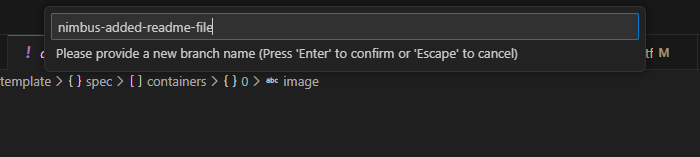
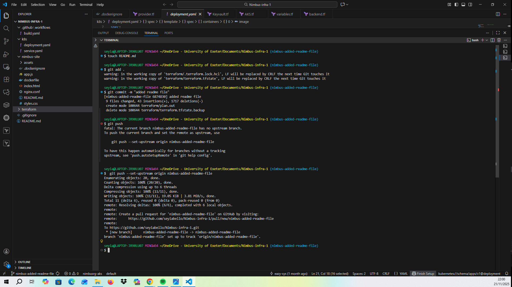
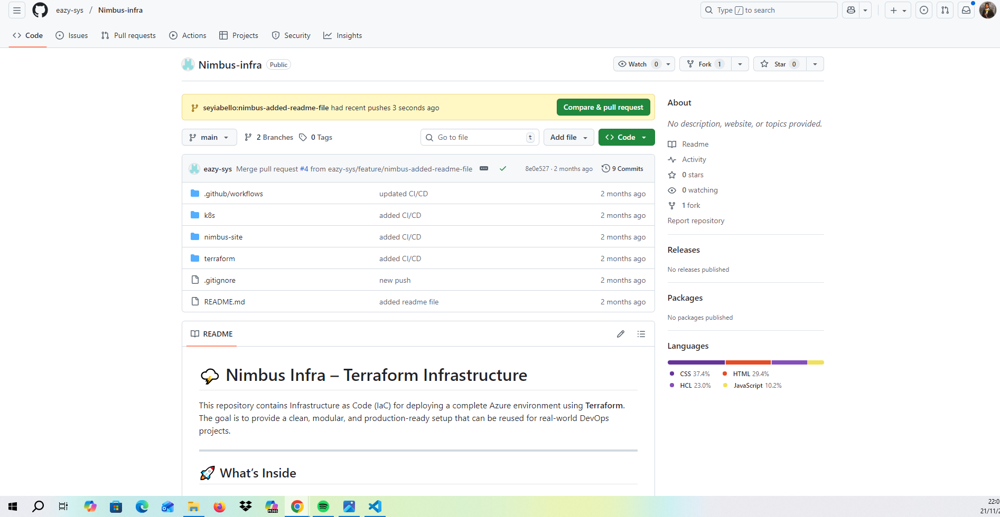
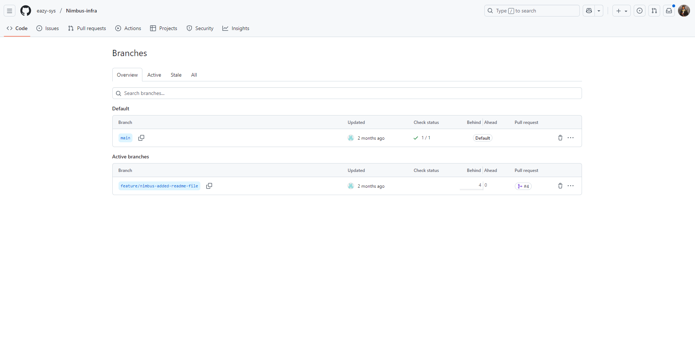

# Git & GitHub – Professional DevOps Version Control Workflow

This repository documents my full Git & GitHub workflow as part of mastering Version Control for DevOps.  
It demonstrates the same workflows used by real engineering teams when collaborating on code and managing CI/CD pipelines.

---

## 🚀 What This Module Covers

### Core DevOps Git Skills Learned:
- Initializing Git locally  
- Connecting VS Code to GitHub  
- Staging, committing, pushing, and pulling  
- Branching workflows (Feature → Review → Merge)  
- Working with Pull Requests  
- Using `.gitignore` correctly  
- Linking GitHub with Terraform, Docker, Kubernetes & CI/CD  

---

## 📁 Project Folder Structure

git-github-project/
│
├── README.md
│
├── images/
│ ├── create-new-branch.png
│ ├── branch-name.png
│ ├── nimbus-added-readme.png
│ ├── push.png
│ ├── pullrequest1.png
│ ├── pull-request.png
│ ├── code.png
│ ├── no-conflicts.png
│
└── .gitignore

yaml
Copy code

---

## 🔗 Link to Related Code (Terraform Project)

Here is the Terraform code I pushed earlier:

👉 **https://github.com/seyiabello/azure-terraform-infra/tree/main/terraform**

---

## 🖼️ Process Screenshots

### Creating a new branch  

### Naming the branch  

### Switching to feature branch  

### Adding, committing, and pushing changes  

### Opening the Pull Request  

### Pull Request interface  

### Viewing project code  

### No merge conflicts  

---

## 🧠 What I Gained From This Project

- I now understand how Git tracks every change in a project.  
- GitHub is now my single source of truth for Terraform & CI/CD projects.  
- I can collaborate like real engineering teams using feature branching.  
- I know how to safely merge code without breaking the main branch.  
- I'm comfortable pushing, pulling, cloning, branching, and making PRs.

---

## 🏁 Conclusion

This project represents my complete Git workflow — exactly how DevOps engineers collaborate professionally.  
From branching to Pull Requests, merging, versioning, and syncing with VS Code…  
I now have the complete workflow mastered.
